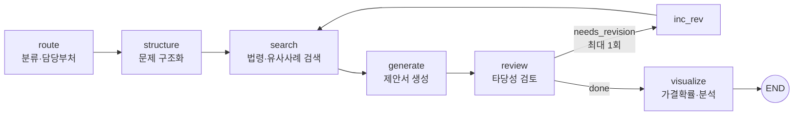

# AI 신문고

LLM 멀티에이전트 기반 국민신문고 민원·제안·청원 자동 구조화 및 정책 제안서 생성 플랫폼

시민이 자연어(텍스트·음성·첨부파일)로 문제를 입력하면, 에이전트가 민원/제안/청원을 분류하고 처리에 필요한 누락 정보를 되묻습니다. 이후 관련 법령을 검색해 정책 제안서 초안을 만들고, 자체 검토 결과에 따라 재검색·재작성한 뒤 가결 확률과 소관 위원회 등 분석 결과와 함께 DOCX 문서로 제공합니다. 같은 방향의 제안이 누적되면 클러스터로 묶어 집단 의견으로 집계합니다.

## 주요 기능

- **대화형 접수**: 분류 직후, 접수 내용에 아직 없는 필수 정보만 골라 명확화 질문을 생성 (이미 언급된 정보는 다시 묻지 않음)
- **자기 검토 루프**: 생성된 제안서를 검토 에이전트가 평가하고, 수정이 필요하면 법령 재검색 후 재생성
- **법령 근거 검색**: 국가법령정보센터 Open API로 관련 법령·판례 검색, 선택적으로 Chroma 벡터 검색 결합
- **정량 분석**: 국회 가결 확률, 예상 소요 기간, 소관 위원회 후보를 ML 모델로 예측
- **집단 의견 집계**: 유사 제안을 클러스터링하고, 임계치 도달 시 법안 문서 생성 트리거
- **멀티모달 입력**: Whisper 음성 입력, PDF·DOCX·이미지 첨부 텍스트 추출

## 아키텍처

### 분석 파이프라인 (LangGraph)

`backend/app/graph/pipeline.py`



각 노드의 진행 상태는 `GET /api/chat/stream`(SSE)으로 프론트엔드에 실시간 전달됩니다.

### 대화형 접수 흐름

`backend/app/api/routes_conversation.py` — 컨텍스트를 요청/응답 페이로드로 주고받는 stateless 설계로 서버리스 환경에서도 동작합니다.

| 단계 | 엔드포인트 | 처리 |
|---|---|---|
| start | `POST /api/conversation/start` | 분류, 소관 위원회 추천, 명확화 질문 생성 |
| answer | `POST /api/conversation/answer` | 답변 반영 초안 제안서, 가결 확률을 높이는 개선안 제시 |
| finalize | `POST /api/conversation/finalize` | 최종 제안서 및 DOCX 생성 |

### 에이전트 구성

| 에이전트 | 파일 | 역할 |
|---|---|---|
| Router | `agents/router.py` | 민원/제안/청원 분류, 담당 부처·주제·키워드 추출 |
| Questioner | `agents/llm_questioner.py` | 누락된 필수 정보에 대한 맞춤형 명확화 질문 생성 |
| Structurer | `agents/llm1_structurer.py` | 원인·대상·해결 방향으로 문제 구조화, 제안서 생성 |
| Searcher | `agents/llm2_searcher.py` | 관련 법령·판례·유사 사례 검색 |
| Reviewer | `agents/llm3_reviewer.py` | 제안서 타당성 점수, 강점·약점, 수정 필요 여부 판단 |
| Visualizer | `agents/llm4_visualizer.py` | 가결 확률·소요 기간 등 분석 결과 구성 |
| Improver | `agents/llm_improver.py` | 통과 가능성을 높이는 구체적 개선안 3~4개 제시 |
| Bill Generator | `agents/llm_bill_generator.py` | 정책 제안서를 정식 법안 형식으로 변환 |

### ML 모델

| 모델 | 구성 | 용도 |
|---|---|---|
| 가결 확률 | KoBERT 임베딩 + Logistic Regression | 법안 텍스트의 국회 가결 확률 |
| 소요 기간 | KoBERT 768d → PCA 128d + 메타 피처 10d → LightGBM | 가결까지 예상 일수 (log1p 회귀) |
| 위원회 추천 | TF-IDF + Logistic Regression | 소관 상임위원회 후보 |
| 접수 유형 분류 | TF-IDF + Logistic Regression | 민원/제안/청원 분류 (LLM 분류의 보조) |

## 기술 스택

- **Backend**: FastAPI, LangGraph, Pydantic, Instructor, SQLAlchemy (SQLite / PostgreSQL)
- **LLM**: OpenAI GPT 계열 (기본), Anthropic Claude (대체 경로) — 모델명은 환경변수로 지정
- **검색**: 국가법령정보센터 Open API, Tavily 웹 검색, Chroma + Ko-SRoBERTa 임베딩 (선택)
- **ML**: KoBERT, scikit-learn, LightGBM
- **음성**: OpenAI Whisper API
- **Frontend**: Next.js 14, TypeScript, Tailwind CSS, Recharts
- **배포**: Vercel (프론트), Railway (백엔드·PostgreSQL) — 상세는 [DEPLOY.md](DEPLOY.md)

## 프로젝트 구조

```
backend/app/
├── agents/       # LLM 에이전트
├── graph/        # LangGraph 파이프라인
├── api/          # FastAPI 라우터 (chat, conversation, cluster, bill, upload, voice, admin)
├── rag/          # 법령 API 연동, Chroma 인덱서·검색기
├── ml/           # ML 모델 어댑터 및 싱글턴 레지스트리
├── aggregator/   # 제안 클러스터링, 임계치 트리거
├── stt/          # Whisper 음성 인식
├── utils/        # DOCX 생성, 첨부파일 텍스트 추출
└── storage/      # DB 모델, 시드 데이터
frontend/
├── app/          # 홈, 접수 결과, 클러스터, 제안 목록, 관리자 페이지
└── components/   # ChatBox, ConversationBox, ClusterStatus
```

## 실행 방법

### Backend

```bash
cd backend
pip install -r requirements.txt
uvicorn app.main:app --reload --port 8001
```

### Frontend

```bash
cd frontend
npm install
npm run dev   # http://localhost:3000
```

### 환경 변수 (`backend/.env`)

```
OPENAI_API_KEY=            # 필수
OPENAI_MODEL_NAME=gpt-4o-mini
ANTHROPIC_API_KEY=         # 선택
LAW_API_KEY=               # 선택, https://open.law.go.kr 발급 (미설정 시 샘플 법령 데이터)
TAVILY_API_KEY=            # 선택, 웹 검색
ENABLE_CHROMA=false        # true 시 Chroma 벡터 검색 활성화
ML_ENABLE_KOBERT=true      # false 시 KoBERT 기반 모델 로딩 생략 (메모리 절약)
DATABASE_URL=              # 미설정 시 SQLite
```

프론트엔드는 `frontend/.env.local`에 `NEXT_PUBLIC_API_URL`을 지정합니다.

## 주요 API

| Method | Endpoint | 설명 |
|---|---|---|
| POST | `/api/conversation/start` · `/answer` · `/finalize` | 대화형 접수 3단계 |
| POST | `/api/chat` | 분석 파이프라인 일괄 실행 |
| GET | `/api/chat/stream` | 분석 파이프라인 SSE 스트리밍 |
| POST | `/api/session/{id}/bill` | 정식 법안 형식 변환 |
| GET | `/api/session/{id}/download/docx` | 제안서 DOCX 다운로드 |
| GET | `/api/clusters` · `/api/cluster/{id}` | 집단 의견 클러스터 조회 |
| POST | `/api/upload` | 첨부파일 업로드 및 텍스트 추출 |
| POST | `/api/voice/transcribe` | 음성 → 텍스트 |

## 한계 및 향후 과제

- 접수 유형 분류기는 직접 구축한 시드 문장 221개(민원 71, 제안 75, 청원 75)로 학습했으며, 실제 국민신문고 데이터로의 검증은 이루어지지 않았습니다.
- 명확화 질문은 한 번에 일괄 생성하는 방식으로, 답변에 따라 다음 질문을 다시 정하는 순차적 문답은 지원하지 않습니다.
- Chroma 벡터 검색은 로컬 Windows 환경 호환성 문제로 기본 비활성화되어 있습니다.
